# 课程介绍

> webpack: [改变前端开发的方式](https://www.webpackjs.com/)（传统的 => 工程化的）


本质上，*webpack* 是一个现代 JavaScript 应用程序的*静态模块打包器(module bundler)*。当 webpack 处理应用程序时，它会递归地构建一个*依赖关系图(dependency graph)*，其中包含应用程序需要的每个模块，然后将所有这些模块打包成一个或多个 *bundle*。

总结：webpack就是一个前端模块（js和其它文件）打包工具

## 目标和内容

- 理解 webpack 的作用，自己能搭一个**工程化**开发的环境   vue-cli   react-cli   angular-cli
  - **打包**
    1. 支持模块化
    3. 引入 loader 之后，就可以处理更多的文件类型。
    4. 优化: 代码压缩,加密
    5. 浏览器兼容性处理
    6. 自动实时预览
- 掌握 webpack 的基本使用： **配置 webpack.config.js**
  - **基本使用**
    - 打包类型
    - 入口
    - 出口
  - loader
    - webpack 看来，一切皆模块。它自己只能处理.js，其它的要依赖于 loader 来处理
  - plugin
    - 扩展功能，增强webpack能力

* 说明：webpack使用中的配置不需要记忆，使用时查阅文档即可


# 安装和基本使用

## 前导

对比展示两种开发方式：

- A. 传统方式，不使用构建工具
- B. 工程化的方式，使用 webpack   gulp 、vite、  

### 示意图对比

传统方式

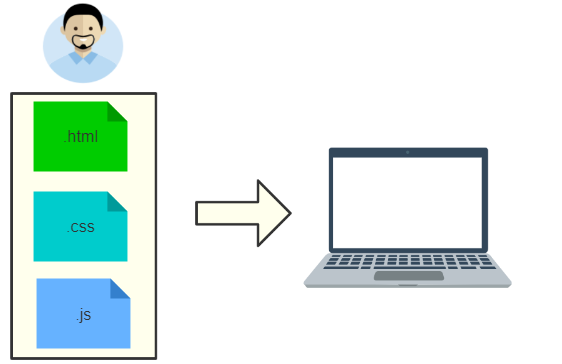

工程化

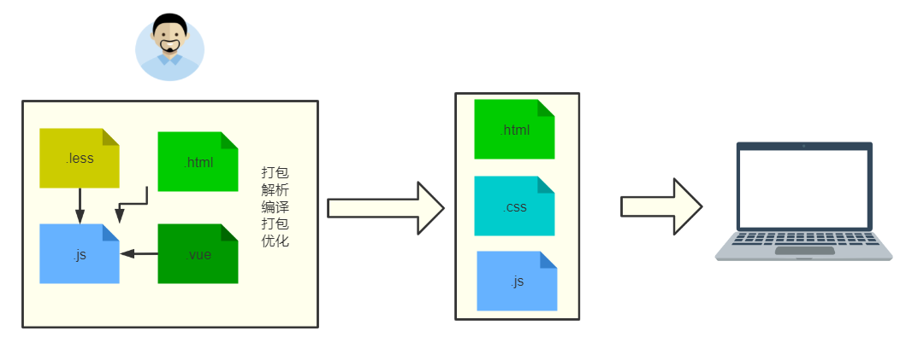

### 明细对比

|                          | 传统方式             | 工程化方式 |
| ------------------------ | -------------------- | ---------- |
| 能否采用 js 模块化       | 不能（逐步支持）     | 能         |
| js 代码否能加密          | 不能                 | 能         |
| css 代码能否压缩         | 不能                 | 能         |
| 是否支持 css 预编译语言  | 不能                 | 能         |
| 是否支持实时预览         | 不能                 | 能         |
| 是否方便处理浏览器兼容性 | 不方便，需要手动处理 | 方便       |


### 小结

- webpack 是一个工具，引这个工具之后就可以改变开发方式，提升开发效率；

- 在 vuecli 中已经集成了这个工具；

[webpack](https://www.webpackjs.com/concepts/)是是一个现代 JavaScript 应用程序的*静态模块打包器(module bundler)*。

> 它是基于 nodejs，所以本机一定要先安装了 node。   vue-cli 2    vue init  webpack  项目名

vuecli 中集成了 webpack ，当我们运行 npm run serve/build 时，就是在调用 webpack!

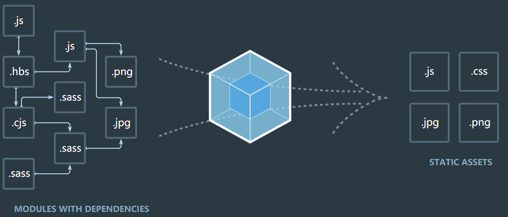

打包：.less, .vue,.js等打包=》静态的文件，让浏览器能认识。


## 传统项目示例

创建三个文件 index.html,index.js,tool.js，最后的项目结构是：

```
|-index.html
|-index.js
|-tool.js
```

拷贝如下素材:

index.html

```html
<!DOCTYPE html>
<html lang="zh">
  <head>
    <meta charset="UTF-8" />
    <title>index</title>
  </head>
  <body>
    <div id="app"></div>
    <!-- 引入两个js文件 -->
    <script src="./tool.js"></script>
    <script src="./index.js"></script>
  </body>
</html>
```

tool.js

```javascript
const updateDom = (id, content) => {
  window.document.getElementById(id).innerText = content
}
```

index.js

```jav
updateDom ('app','index.html')
```

说明：

- 在一个 html 中引入多个 js 文件，并且要注意它们的顺序关系。
- script 代码在 body 的底部，这样可以确保是 dom 节点渲染在 js 代码执行之前。

因为在 index.js 要用到 tool.js 的功能，所以还在 index.html 中同时引用了 index.js 和 tool.js，并把 tool.js 的引用放在 index.js 的引用之前。如下整个代码的示意图：

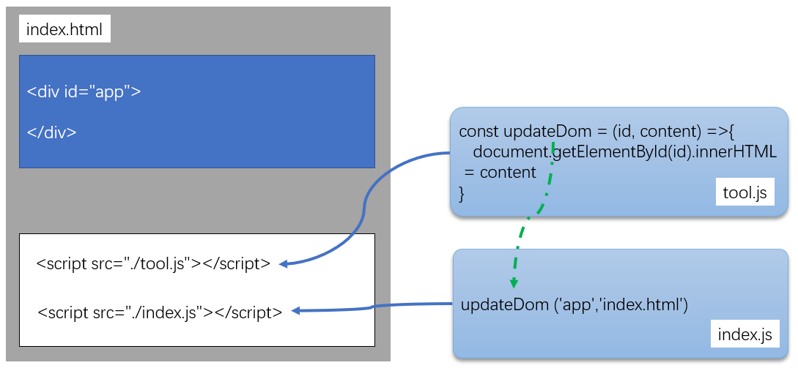

上面的代码中有如下问题：

- js 文件之间有先后的引用的关系：由于 index.js 中引用了 tool.js 的，所以必须要把 tool.js 放在 index.js 的前面。
- 存在变量污染的情况：一个文件中定义的变量，在另一个文件中可能会被修改，覆盖。
- 随着.js 文件个数增加，则项目会越来越不好管理。
- 不能采用模块化的技术进行开发。


## 在传统项目中引入 webpack

> 由于 webpack 这个工具是在 node 环境中运行的，所以要使用它，必须提前安装 nodejs。

基本步骤是：

1. 用 npm 对项目进行初始化；
2. 安装并使用 webpack。`（要先有项目，然后再用webpack来优化开发）`

### 初始化项目

任意新建一个空文件夹，取名为 webpack-demo，进入到文件夹内部，用如下命令来生成一个 package.json

```
npm init -y
```

### 在项目中安装 webpack

考虑到不同的项目中可能使用了不同的 webpack 版本，这里采用本地安装的方式。

#### 安装命令

```bash
npm i webpack webpack-cli -D  // --save-dev   --save  -S
```

> 在 webpack4.X 版本中，需要同时安装`webpack` `webpack-cli` （在 3.X 中，它们集成在一起的），安装了 webpack-cli 之后，才能使用 webpack 命令。

- 如果你看到如上所示的输出内容，就表示安装已经成功了。

#### 检查是否安装成功

```
# 方式一：
node_modules/.bin/webpack -v
# 方式二：
npx webpack -v
```

注意：

- 由于 webpack 并**不是全局安装**的，所以并不能直接使用`webpack -v`来做检验。
- npx 是 npm5.2 之后提供的新功能。它在运行时会在`node_modules/.bin`中去检查命令是否存在。

### 调整代码

#### 调整目录结构

做一件事：把 js 代码放在名为 src 的目录下

```
-package.json
-src
--index.js
--tool.js
```

#### 修改代码内容

以**模块化**的方式来写代码，具体做两个改动：

- 在 tool.js 中导出模块
- 在 index.js 中使用模块

#### tool.js

它用来提供一个方法，供其它模块来使用。

* 使用 commonjs 规范（就是 node.js 中的导出模块的方式）导出工具方法
* 也可以使用esm（EcmaScript Module）方式

```diff
const updateDom = (id, content) =>{
    window.document.getElementById(id).innerHTML = content
}
+ export { updateDom }
```

#### index.js

在 index.js 中引入 tool.js 中的定义的方法。注意，这里已经涉及到了`在一个js中引用另一个js`

```diff
+ import { updateDom } from './tool'
updateDom ('app','index.html')
```

> 由于现在js 中使用了es6模块化，如果直接在 index.html 中引用，浏览器会报错。

我们接下来就需要使用 webpack 命令来对 index.js 进行处理了。

### webpack 打包

webpack4.x开始 提出了零配置打包的口号：不要写任何的配置文件，就可以对代码进行打包。

打包命令是：

```
npx webpack
# 或者是
node_modules/.bin/webpack index.js
```

如果没有遇到错误，会看到类似的结果如下：

```
$ npx webpack
---------------------------------------
Hash: e9e78aff08e09e378b29
Version: webpack 4.44.1
Time: 922ms
Built at: 2020-07-31 9:51:33 AM
  Asset      Size  Chunks             Chunk Names
main.js  1.07 KiB       0  [emitted]  main
Entrypoint main = main.js
[0] ./index.js 159 bytes {0} [built]
[1] ./tool.js 136 bytes {0} [built]
```

它说明打包操作已经成功：index.js 和 tool.js 已经合成了一个 main.js 文件了。

示意如下：

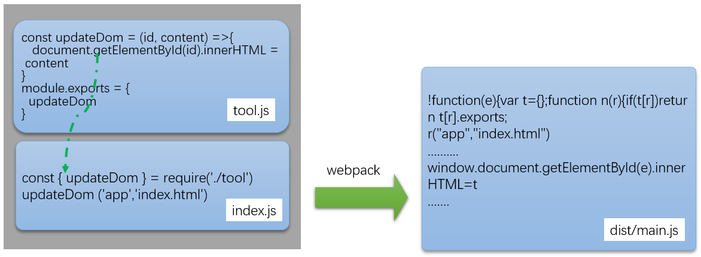

### 引入打包后的 js

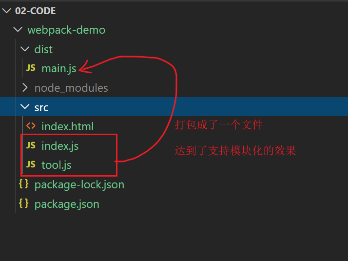

把上面打包完成的 main.js 引入到 index.html

```
<!DOCTYPE html>
<html lang="zh">

<head>
  <meta charset="UTF-8">
  <title>index</title>
</head>

<body>
  <div id="app">

  </div>
  <!-- 引入打包后的.js文件 -->
  <script src="../dist/main.js"></script>
</body>

</html>
```

好的，现在你已经可以看到这个代码可以正常工作了吧。

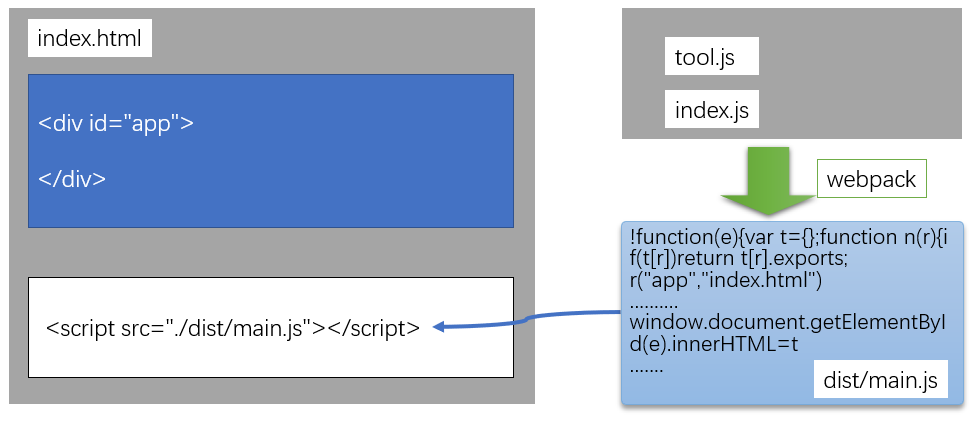

## 小结

- webpack 可以帮助我们改进前端开发方式；
- 是基于 nodejs 的，在使用它之前要**初始化项目**，并局部安装 webpack。
- 它支持零配置打包：默认打包的入口是 src/index.js
- 它支持模块化的写法：js 文件之间是独立的作用域，支持相互引用。
- 它能把多个存在引用关系的 js 打包成一个文件后，默认打包后会放在 dist/main.js 中。
- 打包的命令是：`npx webpack`


# webpack 配置文件

目标：

- 学习使用 webpack 的配置文件
- 会指定打包模式，并了解两种打包方式的区别
- 会指定入口,出口文件
- 会设置 devtool
- 在不同的场景下定制不同的配置文件
- 简化打包命令

webpack 提供的零配置功能很弱，不能做定制，它同时还提供一个配置文件，允许我们定制功能。

## 零配置对应的配置文件

webpack 在工作时，它会默认去根目录下找一个名为`webpack.config.js`的文件（如果找不到，则它会用一些默认设置以支持它的零配置特性。）。这个名为 webpack.config.js 的文件就是 webpack 的配置文件，在这个配置文件中，我们可以根据需要灵活地进行配置，让整体打包更加灵活。

在根目录下创建一个名为 webpack.config.js, 并写入如下内容：

```javascript
const path = require('path')
module.exports = {
   mode: "production",
   entry: './src/index.js',
   output: {
       "path": path.join(__dirname,'/dist'),
       "filename": "main.js"
   }
}
```

然后，再次运行打包命令，查看产生的 main.js 文件的内容，对比与之间的变化。

## 配置文件的基本设置

### 打包模式

webpack.config.js 中的 mode 项用来设置打包的方式，如果不设置，会默认为 production。参考[官网](https://www.webpackjs.com/concepts/mode/)

```javascript
module.exports = {
  mode: 'development',
}
```

webpack 给 mode 提供了两个模式:

- development : 开发模式。此时产生的代码(dist/main.js) 还是可以读的，体积很大

- production: 生产模式。它会自动启用 webpack 内部的一些优化措施，例如：压缩，混淆，加密.......， 总之是让代码不可读，不可还原。

### 入口和出口的概念

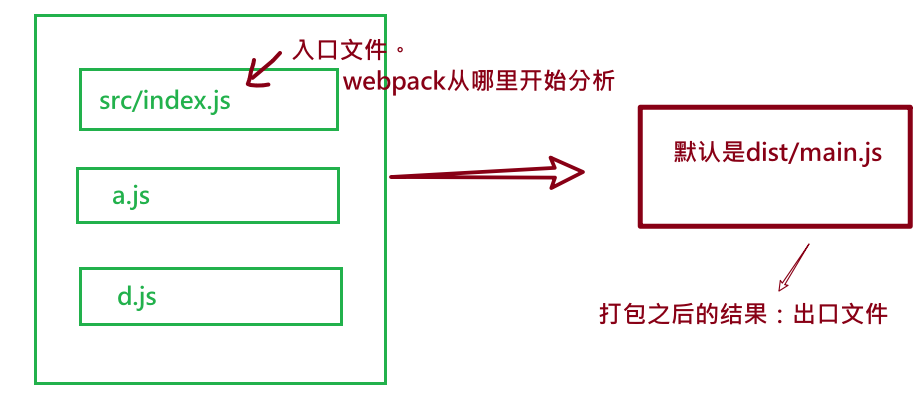

在 webpack 中：

- 默认入口是：./src/index.js

- 默认出口是：./dist/main.js。

也就是说，如果直接在根目录下运行 webpack，它会直接去找.src 下的 index.js，并把打包之后的代码放在 dist/main.js 下。

### 设置入口文件

> webpack 的默认值：src/index.js

需求：如果在实际开发中，希望：

- 这个入口文件不是 index.js，而是 main.js
- 整体 js 文件不是放在 src 目录下，而是 src/js 下。

解决：

(1) 调整目录结构如下：

```
|-package.json
|-index.html
|-src/
|-src/js
|-------main.js
|-------tool.js
```

> 新建立一个目录 js，并把 index.js 改成 main.js

(2) 然后，修改配置项

1. 修改 src/index.js 的名字为 src/js/main.js
2. 在 webpack.config.js 的配置项中添加 `entry`项

```
module.exports = {
  mode: 'development', // 打包方式
  entry:'./src/js/main.js' // 入口文件
}
```

3. 重新打包，测试。

### 指定出口文件

> webpack 的默认值：默认值 dist/main.js

需求： 把出口文件放在 build 目录下的 bundle.js 中

在 webpackage.js 中设置 output 项。

```javascript
// 引入nodejs中的核心模块
const path = require('path')
console.log(path.join(__dirname, '/build'))
module.exports = {
  mode: 'production',
  entry: './src/js/main.js', // 入口文件
  output: {
    path: path.join(__dirname, '/build'), // 决定出口文件在哪里
    filename: 'bundle.js', // 设置出口文件的名字。默认情况下，它叫main.js
  },
}
```

说明：

- output 中的 filename 用来指定打包后的文件名字。
- output 中的 path 用来指定打包后的路径。注意：它必须是**绝对路径**。所以，这里引用 path 模块中的 join 和\_\_dirname 来生成绝对路径。
- 如果 path 中的路径不存在，它会自动创建。

### devtool

它的作用是：可以生成一个 map 文件，用来联系打包前 的代码和打包后的文件之间的关系，方便我们调试。

[devtool](https://www.webpackjs.com/configuration/devtool/):

- "source-map"：把映射关系生成在单独的 map 文件中。

- "inline-source-map" : 把映射关系保存在打包文件中

结论：

- 如果你的代码要上线，可以不设置 devtool，这样就不会有 map 文件


## 指定配置文件

配置文件是可以自行指定的，不一定非要要叫`webpack.config.js`。

**下面，自已创建一个 webpack.build.js 的文件，用它来做配置文件。**

在项目根目录下创建`webpack.build.js`，内容如下：

```js
const path = require('path')
console.log('绝对路径：', __dirname)
module.exports = {
  mode: 'production',
  entry: './src/index.js',
  output:{
    path: path.join(__dirname, '/dist'),
    filename:'bundle.js'
  }
}
```

下面，希望使用这个配置文件中的设置来打包。

它的格式是：

```
npx webpack --config webpack的配置文件
```

运行命令：

```
npx webpack --config webpack.build.js
```

结论：
* `npx webpack` 会去找 webpack.config.js 找到了就用；找不到不会报错，会用它的零配置去打包。

* `npx webpack --config webpack.build.js` 指定用某个配置文件

## 简化打包命令

可以在 package.json 中添加 script 命令来快速启动 webpack

格式：

```
"scripts": {
    "自定义命令名": "要具体执行的代码",
  }
```

示例

```diff
"scripts": {
+    "dev": "webpack  --config webpack.build.js",
+    "build": "webpack",
    "test": "echo \"Error: no test specified\" && exit 1"
  },
```

这样 ，我们就得到了两个可以执行的命令: dev, build 。

可以在控制台中通过:

```
npm run build
# 相当于是 npx webpack
```

或者是：

```
npm run dev
# 相当于是 npx webpack --config webpack.dev.js
```

注意：

- 在 script 中不再需要添加 npx。它会自动在 node_modules/.bin 中去找命令。


## 小结

- **学习 webpack 主要就是学习 webpack.config.js 的使用**。

- webpack 的配置文件默认名是`webpack.config.js`，也可以单独指定。

  `webpack --config 配置文件`

- 把 webpack 的命令集成到 package.json 中的 scripts 中可以简化打包命令。

- 自行定义: mode,entry,output, devtool

# webpack-loader 使用

目标：

- 能处理 css,less 文件，解决 css 的浏览器兼容性配置
- 能处理字体文件
- 能处理图片文件
- 能处理 js 降级问题

在 webpack 看来 **一切皆模块=>**图片，样式文件，js 文件.... 。 但是 webpack 默认只能处理 js 模块，对于非 js 的内容它就需要一些帮手来处理了。这些帮手就是[loader](https://www.webpackjs.com/loaders/)。

> webpack 可以使用 [loader](https://www.webpackjs.com/concepts/loaders) 来预处理文件。这允许你打包除 JavaScript 之外的任何静态资源。

## 处理 css 文件

下面，我们来讨论如何处理.css 文件。

### 创建.css 文件

在 src 目录下，再次创建一个 css 目录

```
|-src
|-src/css
|--------public.css
|--------style.css
```

src/css/public.css 的内容如下

```css
body,
html {
  padding: 0;
  font-size: 14px;
}
```

src/css/style.css 的内容如下

```css
@import 'public.css';
div {
  border: 4px solid #ccc;
  border-radius: 6px;
  width: 50%;
  height: 200px;
  margin: 30px auto;
  box-shadow: 3px 3px 3px #ccc;
  background-color: #fff;
  text-align: center;
}
```

说明：

- @import 语句用来导入另一个 css 文件。

如果希望在.html 文件中使用 style.css 样式，我们以前只学习过一种方式：直接在.html 中通过 link 的方式来引入 。

那如果在 js 中引入了 css 会怎么样呢？

### 在.js 中导入 css

在 js 文件中引入 css，就像 vue 项目中引入第三方 ui 样式一样,如[element-ui 的使用说明](https://element.eleme.cn/#/zh-CN/component/quickstart#wan-zheng-yin-ru)中提到的：

```javascript
import Vue from 'vue'
import ElementUI from 'element-ui'
// 引入 css
import 'element-ui/lib/theme-chalk/index.css'
import App from './App.vue'

Vue.use(ElementUI)

new Vue({
  el: '#app',
  render: (h) => h(App),
})
```

很明显，上面的.js 代码中引入了.css。

下面，我们修改自已的 main.js，在 src/js/main.js 中，引入 css。

```diff
// es6中的模块化
import { updateDom } from './tools'

+ import '../css/style.css'
updateDom ('app','index.html')

```

再次，打包代码，会报错。

```
ERROR in ./src/css/style.css 1:0
Module parse failed: Unexpected character '@' (1:0)
You may need an appropriate loader to handle this file type, currently no loaders are configured to process this file. See https://webpack.js.org/concepts#loaders
> @import "public.css";
| div {
|   padding:20px;
 @ ./src/js/main.js 4:0-26
```

上面报错的原因是:**webpack 把.css 文件内容当作了 js 代码来运行**，那当然会报错了。所以，解决方法是安装相应的 loader 来处理。

### 安装并使用 css-loader

对于所有的 loader 的使用，其基本步骤是一致的，分成两步：

- 1. 安装 loader 包
- 2. 配置 webpack.config.js 中的 module

#### 安装

```
npm i css-loader -D
```

它也是开发依赖。

#### 在配置文件中使用

修改 webpack.config.js 文件，添加 modules

```diff
const path = require('path')
module.exports = {
  mode: 'development',
  entry:'./src/js/main.js',
  output:{
    path:path.resolve(__dirname, './build'),
    filename:'bundle.js'
  },
+  module:{ // 处理非js模块
+    rules:[ // 规则
+      {
+        test: /\.css$/, 		// 正则测试
+        use: ['css-loader'] 	// loader
+      }
+    ]
+  }
}
```

#### 再次打包

它不会报错。但是，页面上也并没有出现样式的效果。打包之后的文件中并没有包含 css 代码。

### 安装并使用 style-loader

如果我们希望样式生效，最终在.html 文件中有两种情况：

- 有 style 标签
- 有 link 标签

而 css-loader**只是能让你在.js 中通过 import 来引入.css**，如果你希望引入的 css 代码最终以 style 标签的方式插入到 html 页面中，则还需要安装一个 loader:style-loader

#### 安装

```
npm i style-loader -D
```

#### 配置

```diff
// node 中的核心模块
const path = require('path')
// __dirname: 全局变量，指向当前目录绝对地址
// console.log(__dirname)
// // path.join是拼接
// console.log( path.join(__dirname, 'dist123') )

// 1. 导出一个配置
// 2. mode, entry, output...... 都是webpack这个工具约定的配置名称
// 每一项都有自己的作用
// 3. 学习webpack 就是学习webpac.config.js中的配置项的使用方式
module.exports = {
  // mode: 'production',
  mode: 'development',
  // devtool: 'source-map',
  // devtool: 'inline-source-map',
  // 入口
  // 默认入口：src/index.js
  entry: './src/js/index.js',
  // 出口
  // 默认出口： dist/main.js
  output: {
    filename: 'main.js',
    // path: 必须是一个绝对路径
    path: path.join(__dirname, 'build')
  },
  module: {
    rules: [
      // 每一个对象就是一条规则.
      //  test: 匹配
      //  use: 对匹配到的模块采用对应的loader
      {
        test: /\.css$/, // 正则匹配 .css文件
        // 匹配成功后（从后向前；从右到左）
        // 1. 先用css-loader去加载.css文件
        // 2. 再用style-loader把样式以style标签的方式嵌入到html中
-        use: ['css-loader']        
+        use: ['style-loader', 'css-loader']
      }
    ]
  }
}
```

> Tip: 在有多个 loader 的情况下，use 数组中的 loader 执行顺序是**从右到左**的过程。即：

- 先用 css-loader 来处理 css
- 再用 style-loader 把 css 代码插入到 html 中的 style 标签中。

#### 打包查看效果

index.html

```
<!DOCTYPE html>
<html lang="zh">
<head>
    <meta charset="UTF-8">
    <title>index</title>
    <!-- <link rel="stylesheet" href="./css/style.css"> -->
  </head>
  <body>
    <div id="app">

    </div>
    <!-- 引入两个js文件 -->
    <!-- <script src="./index.js"></script>
    <script src="./tool.js"></script> -->

    <!-- 引入打包之后的js -->
    <script src="../build/main.js"></script>
</body>
</html>
```

现在就能看到 css 的效果了 。

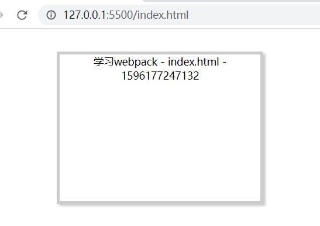

原理是：

- bundle.js 中有一些 js 代码，它在运行时，会自动在.html 文件中追加 style 标签，并输出样式。

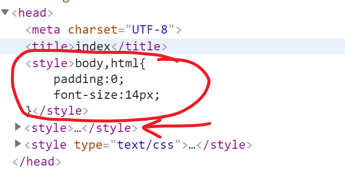

#### 拓展

你可以分析打包之后代码，来验证 style-loader 的工作原理。在 main.js 中，可以找到类似如下的代码：

```
eval("var api = __webpack_require__(/*! ../../node_modules/style-loader/dist/runtime/injectStylesIntoStyleTag.js */ \"./node_modules/style-loader/dist/runtime/injectStylesIntoStyleTag.js
```

再去`node_modules\style-loader\dist\runtime\injectStylesIntoStyleTag.js` 找下`insertStyleElement`这个方法，你就可以发现这个过程。


## 处理 less 文件

目标：在项目中支持使用 less 来写 css 代码。

### 使用less

#### 创建 less 文件

在 src 目录的 css 目录下创建 index.less，则内容如下：

```css
@import "style.css";

body {
  div {
    background: orange;
    color: #fff;
    line-height: 200px;
    font-size: 28px;
  }
}
```

#### 在.js 中引用.less

在 src/js/main.js 文件中引入 less

```diff
// es6中的模块化
import { updateDom } from './tools'

- import '../css/style.css'
+ import '../css/index.less'
updateDom ('app','index.html')

```

### 安装并配置

#### 安装loader

参考[官网](https://www.webpackjs.com/loaders/less-loader/#%E5%AE%89%E8%A3%85)

```bash
npm i less-loader less -D
```

- less 用来把 less-->css
- less-loader 用来加载 less 文件。

#### 配置模块

在 rules 中添加一个配置，专门针对 less 文件。

```diff
// node 中的核心模块
const path = require('path')
// __dirname: 全局变量，指向当前目录绝对地址
// console.log(__dirname)
// // path.join是拼接
// console.log( path.join(__dirname, 'dist123') )

// 1. 导出一个配置
// 2. mode, entry, output...... 都是webpack这个工具约定的配置名称
// 每一项都有自己的作用
// 3. 学习webpack 就是学习webpac.config.js中的配置项的使用方式
module.exports = {
  // mode: 'production',
  mode: 'development',
  // devtool: 'source-map',
  // devtool: 'inline-source-map',
  // 入口
  // 默认入口：src/index.js
  entry: './src/js/index.js',
  // 出口
  // 默认出口： dist/main.js
  output: {
    filename: 'main.js',
    // path: 必须是一个绝对路径
    path: path.join(__dirname, 'build')
  },
  module: {
    rules: [
      // 每一个对象就是一条规则.
      //  test: 匹配
      //  use: 对匹配到的模块采用对应的loader
      {
-        test: /\.css$/, // 正则匹配 .css文件
+        test: /\.css|.less$/, // 正则匹配 .css和.less文件
        // 匹配成功后（从后向前；从右到左）
        // 1. 先用less-loader去加载.less文件,转成css
        // 2. 先用css-loader去加载css文件
        // 3. 再用style-loader把样式以style标签的方式嵌入到html中
-        use: ['style-loader','css-loader']
+        use: ['style-loader', 'css-loader', 'less-loader']
      }
    ]
  }
}
```

注意：如上配置中，对于 less 文件的处理涉及三个 loader，其处理顺序是 less-loader --> css-loader-->style-loader。

- less-loader:用来加载 less 文件，并处理成 css
- css-loader：用来加载 css 文件
- style-loader:用来将 css 代码以 style 标签的格式插入到 html 文件中


## 处理font字体图标

目标：在项目中支持字体文件=>拷贝作用

### 使用字体图标

步骤：

1. `02-其它资源`中拷贝`素材`下的文件到src/assets目录下
2. 在 css/index.less中引入字体图标样式
3. 在页面中使用=》重新打包报错=》**webpack不能处理字体文件！！！**

```diff
@import 'style.css';
@import 'other.less';
+ @import '../assets/fonts/iconfont.css';
body {
  div {
    padding: 50px;
  }
}
```

### 安装和配置

```
npm i file-loader -D
```

配置文件

```js
// 处理字体文件
{
  test: /\.(woff|woff2|eot|ttf|otf|svg)$/,
    use: {
      loader: 'file-loader',
        options: {
          // [name]: 这里[]表示里面放一个占位符。name就是要处理的文件名
          // [ext]:  这里[]表示里面放一个占位符。ext就是要处理的文件后缀名
          name: '[name].[ext]',           
          // 指定dist下拷贝位置
          outputPath: './assets/fonts'
        }
    }
}
```

* 打包测试，在html中使用图标

```html
  <span class="iconfont icon-edit"></span>
```

注意：

* file-loader 的作用**就是拷贝**，没有做任何处理
* 404是live-server服务器问题


## 处理img图片

目标：在项目中支持对图片的处理：如果足够小就直接生成对应的 base64 编码值，否则就直接拷贝到指定位置。

### 修改案例

#### 提前准备图片

- 使用`src/assets/images`下图片：一张图片大一些，一张图片小一些。
  - webpack.png：53kb
  - timg.gif：340kb
  - small.jpg：8kb

计算机基本数据单位换：

1B（Byte字节）=8bit（比特）

1KB (Kilobyte 千字节)=1024B，

1MB (Mega byte 兆字节 简称“兆”)=1024KB，

**1GB** (Giga byte 吉字节 又称“千兆”)=1024MB，

1TB (Tera byte 万亿字节 太字节)=1024GB，其中1024=2^10 ( 2 的10次方)，

1PB（Peta byte 千万亿字节 拍字节）=1024TB，

1EB（Exa byte 百亿亿字节 艾字节）=1024PB，

1ZB (Zetta byte 十万亿亿字节 泽字节)= 1024 EB,

1YB (Yotta byte 一亿亿亿字节 尧字节)= 1024 ZB,

1BB (Bronto byte 一千亿亿亿字节)= 1024 YB

1NB(Nona byte )= 1024BB

1DB(Dogga byte)= 1024NB


#### 在 css 中引入图片

- 在 style.css 中引入图片，作为 div 标签的 background。

```diff
@import "public.css";
div {
  border:4px solid #ccc;
  width: 50%;
  height: 200px;
  margin:30px auto;
  box-shadow: 3px 3px 3px #ccc;
  background-color:pink;
  text-align: center;
+  background-image: url('../assets/images/webpack.png')
+  background-size: contain;
}

```

直接打包，会报错。

### 安装和配置

* 安装url-loader：npm i  url-loader -D

* 添加配置：

增强版的 file-loader ---> url-loader

```js
      {
        test: /\.(png|svg|gif|jpg)$/,
        use: {
          loader: 'url-loader',
          options: {
            // 是否把一张图转成base64：
            // 优点：减少一次请求
            // 缺点：会增加.js文件的体积
            // 推荐设置：2kb=>不设置默认base64
            
            limit: 10 * 1024, // 如果图片小于10kb就转成base64,否则就直接拷贝(单位：字节)
            name: '[name].[ext]',
            outputPath: './assets/images'
          }
        } 
      }
```

注意⚠️：以实际电脑中图片文件占用磁盘字节大小和limit对比为准

参考链接：[npm 官网](https://www.npmjs.com/package/url-loader)

注意：url-loader可以代替file-loader使用


## 处理 js 兼容

能够把 es6 高级内容变为 es5 的 loader 名称为 **babel-loader**

> es6/es7/es8 等等高级标准有很多(let、箭头函数、对象解构赋值、...展开运算符、字符串模板等等)，每个标准都需要一个独立的**plugin**进行降级处理，如果使用许多高级标准内容，那么势必要为此安装许多 plugin，这样工作比较繁琐，系统已经考虑到这点了，其通过**preset**把许多**常用**的 plugin 给做了集合，因此一般性的使用只需要安装 preset 即可搞定(如果项目应用到了一个生僻的高级标准内容，preset 处理不来，就还需要再安装对应的 plugin 处理)

let----降级---->plugin

箭头函数----降级--->plugin

npm 官网: [babel-loader](https://www.npmjs.com/package/babel-loader)

babel 官网：https://www.babeljs.cn/setup#installation

步骤：

1. 安装依赖包

   ```bash
   npm i babel-loader @babel/core @babel/preset-env -D
   ```

2. 在 webpack.config.js 中做如下配置：

   ```js
     // es6转es5
   {
       test: /\.js$/,
       exclude: /node_modules/,  // 排除目录
       use: [
           {
               loader:'babel-loader',
               options: {
                 presets: ['@babel/preset-env']
               }
            }
       ]
   }
   ```

   说明： @babel/preset-env 用来指定按什么样的预设来进行降级处理

3. 打包测试

   打包之后，去打包后的文件中检查是否已经把 `const` 和箭头函数这种 es6 的代码转成了 es5 的代码。

## 小结

作用：非 js 模块借助 loader 来处理打包

- loader 使用的基本步骤
  - 第一步：安装需要处理文件类型的loader包
  - 第二步：配置 rules处理对应文件类型


# webpack-plugin 使用

目标：

- 能将项目中 css 提取到单独的文件中
- 能使用配置自动导入打包资源到 html 中
- 能使用 clean-webpack-plugin 清空打包目录
- 能做 css 代码和 js 代码压缩优化

> plugin 是用于扩展 webpack 的功能，各种各样的 plugin 几乎可以让 webpack 做任何与构建相关的事情。
>
> plugin 的配置很简单，plugins 配置项接收一个数组，数组里的每一项都是一个要使用的 plugin 的实例，plugin 需要的参数通过构造函数传入。
>
> 所有 webpack 无法直接实现的功能，都能找到开源的 plugin 去解决，我们要做的就是去找更据自己的需要找出相应的 plugin。

## mini-css-extract-plugin

功能：这个插件帮助我们把 css 代码提取到一个独立的文件中（而不是以 style 的方式嵌在 html 文件中）。

npm 官网：https://www.npmjs.com/package/mini-css-extract-plugin

使用：

- 下载安装
- 配置 webpack.config.js
- 运行 webpack 打包，检查效果

### 下载安装

它是一个开发依赖。

```
npm install mini-css-extract-plugin -D
```

### 配置

在 webpack.config.js 中，修改三个地方：

- 引入插件
- 在 less 的 loader 列表中加入插件功能
- 在 plugins 中添加 mini-css-extract-plugin

如下：

```diff
// node 中的核心模块
const path = require('path')

+ const MiniCssExtractPlugin = require('mini-css-extract-plugin')
// __dirname: 全局变量，指向当前目录绝对地址
// console.log(__dirname)
// // path.join是拼接
// console.log( path.join(__dirname, 'dist123') )

// 1. 导出一个配置
// 2. mode, entry, output...... 都是webpack这个工具约定的配置名称
// 每一项都有自己的作用
// 3. 学习webpack 就是学习webpac.config.js中的配置项的使用方式
module.exports = {
  // mode: 'production',
  mode: 'development',
  // devtool: 'source-map',
  // devtool: 'inline-source-map',
  // 入口
  // 默认入口：src/index.js
  entry: './src/js/index.js',
  // 出口
  // 默认出口： dist/main.js
  output: {
    filename: 'main.js',
    // path: 必须是一个绝对路径
    path: path.join(__dirname, 'build'),
  },
  module: {
    rules: [
      // 每一个对象就是一条规则.
      //  test: 匹配
      //  use: 对匹配到的模块采用对应的loader
      {
        test: /\.css|.less$/, // 正则匹配 .css和.less文件
        // 匹配成功后（从后向前；从右到左）
        // 1. 先用less-loader去加载.less文件,转成css
        // 2. 先用css-loader去加载css文件
        // 3. 再用style-loader把样式以style标签的方式嵌入到html中
-        use:['style-loader', 'css-loader', 'less-loader']
+        use: [
          {
            loader: MiniCssExtractPlugin.loader,
            // you can specify a publicPath here
            // by default it use publicPath in webpackOptions.output
            options: { publicPath: '../' },
          },
          'css-loader',
          'less-loader',
+        ],
      },
      {
        test: /\.woff$/,
        use: {
          loader: 'file-loader',
          options: {
            // [name]: 这里[]表示里面放一个占位符。name就是要处理的文件名
            // [ext]:  这里[]表示里面放一个占位符。ext就是要处理的文件后缀名
            name: '[name].[ext]',
            outputPath: './fonts',
          },
        },
      },
      {
        test: /\.(png|svg|gif|jpg)$/,
        use: {
          loader: 'url-loader',
          options: {
            // 把一张图转成base64：

            // 优点：减少一次请求
            // 缺点：会增加.js文件的体积
            // 推荐设置：2k

            limit: 2 * 1024, // 如果图片小于2k就转成base64,否则就直接拷贝
            name: '[name].[ext]',
            outputPath: './img',
          },
        },
      },
      {
        test: /\.js$/,
        exclude: /node_modules/, // 排除目录
        use: [
          {
            loader: 'babel-loader',
            options: {
              presets: ['@babel/preset-env'],
            },
          },
        ],
      },
    ],
  },
+  plugins: [
    new MiniCssExtractPlugin({
      filename: 'css/[name].css',
    }),
+  ],
}
```

打包尝试一下。

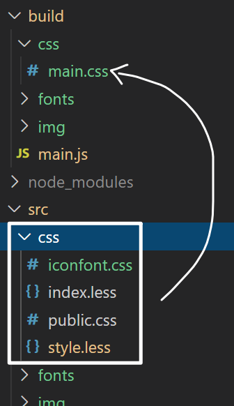

## html-webpack-plugin

功能：把我们自已写的.html 文件复制到指定打包出口目录下，并引入相关的资源代码。

> 为 html 文件中引入的外部资源如 script、link 动态添加每次 compile 后的 hash，防止引用缓存的外部文件问题。可以生成创建 html 入口文件。

官网：https://www.npmjs.com/package/html-webpack-plugin

实现步骤：

### 下载安装

```diff
- npm i html-webpack-plugin -D
+ npm i html-webpack-plugin@next -D
```

说明：安装配合webpack5版本的新插件包

### 配置

在 webpack.config.js 中，做两件事：

1. 引入插件

```js
const HtmlWebpackPlugin = require('html-webpack-plugin');
```

1. 添加一个 plugins 配置

```diff
// node 中的核心模块
+ const path = require('path')
// console.log( path.resolve('./src/index.html')  )

const MiniCssExtractPlugin = require('mini-css-extract-plugin')
const HtmlWebpackPlugin = require('html-webpack-plugin')
// __dirname: 全局变量，指向当前目录绝对地址
// console.log(__dirname)
// // path.join是拼接
// console.log( path.join(__dirname, 'dist123') )

// 1. 导出一个配置
// 2. mode, entry, output...... 都是webpack这个工具约定的配置名称
// 每一项都有自己的作用
// 3. 学习webpack 就是学习webpac.config.js中的配置项的使用方式
module.exports = {
  // mode: 'production',
  mode: 'development',
  // devtool: 'source-map',
  // devtool: 'inline-source-map',
  // 入口
  // 默认入口：src/index.js
  entry: './src/js/index.js',
  // 出口
  // 默认出口： dist/main.js
  output: {
    // filename: 'main.js',
+   filename: 'meng-[fullhash].js'
    // path: 必须是一个绝对路径
    path: path.join(__dirname, 'build'),
  },
  module: {
    rules: [
      // 每一个对象就是一条规则.
      //  test: 匹配
      //  use: 对匹配到的模块采用对应的loader
		  // ...
      {
        test: /\.woff$/,
        use: {
          loader: 'file-loader',
          options: {
            // [name]: 这里[]表示里面放一个占位符。name就是要处理的文件名
            // [ext]:  这里[]表示里面放一个占位符。ext就是要处理的文件后缀名
            name: '[name].[ext]',
            outputPath: './fonts',
          },
        },
      },
      {
        test: /\.(png|svg|gif|jpg)$/,
        use: {
          loader: 'url-loader',
          options: {
            // 把一张图转成base64：

            // 优点：减少一次请求
            // 缺点：会增加.js文件的体积
            // 推荐设置：2k

            limit: 2 * 1024, // 如果图片小于2k就转成base64,否则就直接拷贝
            name: '[name].[ext]',
            outputPath: './img',
          },
        },
      },
      {
        test: /\.js$/,
        exclude: /node_modules/, // 排除目录
        use: [
          {
            loader: 'babel-loader',
            options: {
              presets: ['@babel/preset-env'],
            },
          },
        ],
      },
    ],
  },
  plugins: [
    new MiniCssExtractPlugin({
     filename: 'css/[name]-[fullhash].css',
    }),
+    new HtmlWebpackPlugin({
      minify: {
        // 压缩HTML文件
        removeComments: true, // 移除HTML中的注释
        collapseWhitespace: true, // 删除空白符与换行符
        minifyCSS: true, // 压缩内联css
      },
      filename: 'index-abc.html',
      // path.resolve()就是转成绝对路径
      template: path.resolve('./src/index.html'), // 指定模块的位置
+    }),
  ],
}
```

3. 打包测试

   - 它会把 template 中指定的.html 文件复制（压缩）到出口文件夹
   - 还会自动附上打包之后.css 和 .js 代码


## clean-webpack-plugin

在生成打包文件之前，把出口目录清空掉。

安装

```bash
npm i clean-webpack-plugin -D
```

修改配置文件

1. 引入：

   ```js
   const { CleanWebpackPlugin } = require('clean-webpack-plugin')
   ```

2. 添加 plugins

```diff
plugins:[
+        new CleanWebpackPlugin()，
        // 其它...
]
```


## 代码压缩优化

注意⚠️：打包方式记得设置成`生产模式:mode: 'production'`=》生效

> 对 css 进行压缩和去除console.log日志=>需要单独安装插件

* 安装

```bash
npm i -D optimize-css-assets-webpack-plugin terser-webpack-plugin
```

- 配置optimization

```diff
// node 中的核心模块
const path = require('path')
// console.log( path.resolve('./src/index.html')  )
const { CleanWebpackPlugin } = require('clean-webpack-plugin')
const MiniCssExtractPlugin = require('mini-css-extract-plugin')
const HtmlWebpackPlugin = require('html-webpack-plugin')
+ const OptimizeCssAssetsWebpackPlugin = require('optimize-css-assets-webpack-plugin')
+ const TerserWebpackPlugin = require('terser-webpack-plugin')
// __dirname: 全局变量，指向当前目录绝对地址
// console.log(__dirname)
// // path.join是拼接
// console.log( path.join(__dirname, 'dist123') )

// 1. 导出一个配置
// 2. mode, entry, output...... 都是webpack这个工具约定的配置名称
// 每一项都有自己的作用
// 3. 学习webpack 就是学习webpac.config.js中的配置项的使用方式
module.exports = {
+  mode: 'production',
  // mode: 'development',
  // devtool: 'source-map',
  // devtool: 'inline-source-map',
  // 入口
  // 默认入口：src/index.js
  entry: './src/js/index.js',
  // 出口
  // 默认出口： dist/main.js
  output: {
    filename: 'main.js',
    // path: 必须是一个绝对路径
    path: path.join(__dirname, 'build')
  },
+  optimization: {
    minimizer: [
      // 压缩css
      new OptimizeCssAssetsWebpackPlugin(),
      // 去除log日志
      new TerserWebpackPlugin({
        terserOptions: {
          compress: {
            drop_console: true
          }
        }
      })
    ]
+  },
  module: {
    rules: [
      // 每一个对象就是一条规则.
      //  test: 匹配
      //  use: 对匹配到的模块采用对应的loader
 		  // ...
      {
        test: /\.js$/,
        exclude: /node_modules/, // 排除目录
        use: [
          {
            loader:'babel-loader',
            options: {
              presets: ['@babel/preset-env']
            }
          }
        ]
      }
    ]
  },
  plugins:[
    new CleanWebpackPlugin(),
    new MiniCssExtractPlugin({
      filename:'css/[name].css'
    }),
    new HtmlWebpackPlugin({
      minify: { // 压缩HTML文件
        removeComments: true, // 移除HTML中的注释
        collapseWhitespace: true, // 删除空白符与换行符
        minifyCSS: true// 压缩内联css
      },
      filename: 'index.html',
      // path.resolve()就是转成绝对路径
      template: path.resolve('./src/index.html') // 指定模块的位置
    })
  ]
}
```

* 测试

```js
import { updateDom } from './tools'

// import './css/style.css'
import './css/index.less'
const abc = 123
let fn = () => {
  console.log(abc)
}
console.warn(456)
console.log(123)
updateDom('app', 'index.html')
```


## 小结

作用：plugin 用来增加 webpack 能力

步骤：

1. 下载安装
2. 配置 webpack.config.js
   * 引入插件

   * 添加 plugins 的设置


# 黑科技-实时打包

目标

- 能使用 webpack 实现实时打包预览效果

## webpack 实时打包

目标：实现实时打包预览效果。当我们修改了代码时，立即运行打包命令，并显示效果。

工具：[webpack-dev-server]

- [npm 官网](https://www.npmjs.com/package/webpack-dev-server)
- [配置手册](https://www.webpackjs.com/configuration/dev-server/)

**`注意`**：

- 项目开发都是对 src 目录内部的文件进行更新，不要去修改 dist 打包好的文件
- 现在对 src 内部的任何文件做修改操作后，都需要重新打包，才可以看到对应效果


步骤：

1. 安装

```bash
npm i webpack-dev-server  -D
```

2. 在 webpack.config.js 中做如下配置

   ```json
   module.exports = {
     "devServer": {
       "host": "127.0.0.1", // 地址（默认值）
       "port": 10088, // 端口号
       "open": true // 启动后自动打开浏览器
     }
   }
   ```

3. 在 package.json 中补充一个 script

   ```diff
   "scripts": {
   +    "dev":"webpack serve --config webpack.dev.js",
     },
   ```
   * webpack.dev.js配置：

   ```js
   const path = require('path')
   const MiniCssExtractPlugin = require('mini-css-extract-plugin')
   const HtmlWebpackPlugin = require('html-webpack-plugin')
   const { CleanWebpackPlugin } = require('clean-webpack-plugin')
   const OptimizeCssAssetsWebpackPlugin = require('optimize-css-assets-webpack-plugin')
   const TerserWebpackPlugin = require('terser-webpack-plugin')
   
   module.exports = {
     // mode: 'production',
     mode: 'development',
     entry: './src/index.js',
     output: {
       "path": path.join(__dirname, 'dist'),
       "filename": "js/chunk.js"
     },
     devtool: 'source-map',
     devServer: {
       host: "127.0.0.1",
       port: 10088,
       open: true
     },
     optimization: {
       minimizer: [
         // 压缩css
         new OptimizeCssAssetsWebpackPlugin(),
         // 去除log日志
         new TerserWebpackPlugin({
           terserOptions: {
             compress: {
               drop_console: true
             }
           }
         })
       ]
     },
     // 处理其它文件模块规则
     module: {
       rules: [
         {
           test: /\.css|.less$/, // 正则匹配 .css和.less文件
           // 匹配成功后（从后向前；从右到左）
           // 1. 先用css-loader去加载.css文件
           // 2. 再用style-loader把样式以style标签的方式嵌入到html中
           // use: ['style-loader', 'css-loader', 'less-loader']
           use: [
             {
               loader: MiniCssExtractPlugin.loader,
               options: { publicPath: '../' },
             },
             'css-loader',
             'less-loader',
           ]
         },
         {
           test: /\.(png|svg|gif|jpg|woff|woff2|eot|ttf|otf)$/,
           use: {
             loader: 'url-loader',
             options: {
               // 把一张图转成base64：
   
               // 优点：减少一次请求
               // 缺点：会增加.js文件的体积
               // 推荐设置：2k
               // 不做限制默认转换为base64格式
               limit: 2 * 1024, // 如果图片小于2k就转成base64,否则就直接拷贝
               name: '[name].[ext]',
               outputPath: './assets'
             }
           }
         },
         {
           test: /\.js$/,
           exclude: /node_modules/,  // 排除目录
           use: [
             {
               loader: 'babel-loader',
               options: {
                 presets: ['@babel/preset-env']
               }
             }
           ]
           // es6转es5
         }
       ]
     },
     plugins: [
       new MiniCssExtractPlugin({
         filename: 'css/[name].css',
       }),
       new HtmlWebpackPlugin({
         minify: {
           // 压缩HTML文件
           removeComments: true, // 移除HTML中的注释
           collapseWhitespace: true, // 删除空白符与换行符
           minifyCSS: true, // 压缩内联css
         },
         filename: 'index.html',
         // path.resolve()就是转成绝对路径
         template: path.resolve('./index.html'), // 指定模块的位置
       }),
       new CleanWebpackPlugin()
     ]
   }
   ```
   
   


4. 启动命令

   现在通过 `npm run dev`就可以实现 实时打包、实时编译、实时浏览器查看效果了。它会自动打开一个浏览器窗口。

5. 测试
   - 修改.js 代码，
   - 修改.css 代码，检查是否会重启

注意⚠️：

浏览器看到的实时效果是服务器通过“**`内存`**”提供的，没有物理文件，也不会生成 dist 目录


# 实践-配置 vue 开发环境

> vue-cli是创建和开发vue项目的利器

使用webpack-安装配置vue开发环境，达到**类似vue-cli**工具创建的vue项目的使用效果

目标:

- 配置 webpack，让它能够处理 vue 单文件组件(.vue)
- 理解vue-cli背后的原理

思路：

- 准备空项目和基础文件
- 安装 vue 及处理.vue 文件需要的 loader 和 plugins
- 配置 webpack


## 准备项目

步骤：

1. 新建空目录`webpack-vue`，使用`npm init -y`初始化包管理配置文件
2. 新建public目录，添加入口页面`index.html`
3. 新建src目录，其下添加main.js、App.vue、views和css目录
4. 添加相关文件基础代码，测试使用=》可以使用`02-其它资源/vue-cli-test文件素材`
5. 添加webpack配置（后续支持vue编译打包）：
   * webpack.dev.js（开发调试服务器）和webpack.prod.js（生产打包）=》根据课堂配置复制修改

在 main.js 中，修改代码如下：

```js
import Vue from 'vue'
import App from './App.vue'
import './css/index.less'
new Vue({
  render (h) {
    return h(App)
  },
}).$mount('#app')
```


* 这里使用 Vue 及单文件组件。

* 目录结构：

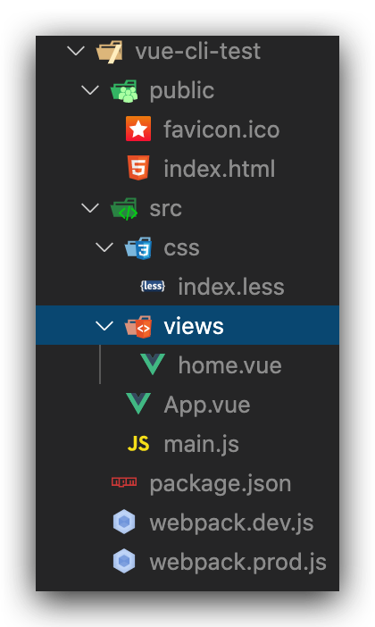

注意：现在 webpack 肯定是无法运行的，因为相关依赖和 loader 还没有安装。


## 安装依赖

* 安装 vuejs

```bash
npm i vue -S
```

它是生产依赖。

* 安装工程化相关依赖

1. 构建打包依赖=>拷贝之前练习的依赖并加上vue的依赖

```json
  "devDependencies": {
    // vue相关loader 依赖
    "vue-loader": "^15.9.3",
    "vue-style-loader": "^4.1.2",
    "vue-template-compiler": "^2.6.12",
    // 基础依赖
    "@babel/core": "^7.12.10",
    "@babel/preset-env": "^7.12.11",
    "babel-loader": "^8.2.2",
    "clean-webpack-plugin": "^3.0.0",
    "css-loader": "^5.0.1",
    "file-loader": "^6.2.0",
    "html-webpack-plugin": "^5.0.0-beta.6",
    "less": "^4.1.0",
    "less-loader": "^7.3.0",
    "mini-css-extract-plugin": "^1.3.4",
    "optimize-css-assets-webpack-plugin": "^5.0.4",
    "style-loader": "^2.0.0",
    "terser-webpack-plugin": "^5.1.1",
    "url-loader": "^4.1.1",
    "webpack": "^5.17.0",
    "webpack-cli": "^4.4.0",
    "webpack-dev-server": "^3.11.2"
  }
```

2. 放入package.json中，使用`npm i`安装

扩展阅读：[vue-loader](https://vue-loader.vuejs.org/guide/#vue-cli)


## 配置 webpack

做两件事:

- 给.vue 文件添加 loader
- 添加 VueLoaderPlugin

> Vue-loader 在 15.X之后的版本都是 vue-loader 的使用都是需要伴生 VueLoaderPlugin 的

```diff
const path = require('path')
const MiniCssExtractPlugin = require('mini-css-extract-plugin')
const HtmlWebpackPlugin = require('html-webpack-plugin')
const { CleanWebpackPlugin } = require('clean-webpack-plugin')
const OptimizeCssAssetsWebpackPlugin = require('optimize-css-assets-webpack-plugin')
const TerserWebpackPlugin = require('terser-webpack-plugin')

+ const VueLoaderPlugin = require('vue-loader/lib/plugin')

module.exports = {
  // mode: 'production',
  mode: 'development',
+  entry: './src/main.js',
  output: {
    "path": path.join(__dirname, '/dist'),
+    "filename": "js/chunk-[fullhash].js"
  },
  devtool: 'source-map',
  devServer: {
    host: "127.0.0.1",
    port: 10088,
    open: true
  },
  optimization: {
    minimizer: [
      // 压缩css
      new OptimizeCssAssetsWebpackPlugin(),
      // 去除log日志
      new TerserWebpackPlugin({
        terserOptions: {
          compress: {
            drop_console: true
          }
        }
      })
    ]
  },
  // 处理其它文件模块规则
  module: {
    rules: [
      {
        test: /\.css|.less$/, // 正则匹配 .css和.less文件
        // 匹配成功后（从后向前；从右到左）
        // 1. 先用css-loader去加载.css文件
        // 2. 再用style-loader把样式以style标签的方式嵌入到html中
        // use: ['style-loader', 'css-loader', 'less-loader']
        use: [
          {
            loader: MiniCssExtractPlugin.loader,
            options: { publicPath: '../' },
          },
          'css-loader',
          'less-loader',
        ]
      },
      {
        test: /\.(png|svg|gif|jpg|woff|woff2|eot|ttf|otf)$/,
        use: {
          loader: 'url-loader',
          options: {
            // 把一张图转成base64：

            // 优点：减少一次请求
            // 缺点：会增加.js文件的体积
            // 推荐设置：2k
            // 不做限制默认转换为base64格式
            limit: 2 * 1024, // 如果图片小于2k就转成base64,否则就直接拷贝
            name: '[name].[ext]',
            outputPath: './assets'
          }
        }
      },
      {
        test: /\.js$/,
        exclude: /node_modules/,  // 排除目录
        use: [
          {
            loader: 'babel-loader',
            options: {
              presets: ['@babel/preset-env']
            }
          }
        ]
        // es6转es5
      },
+      {
        // 如果是.vue文件，使用如下的loader
        test: /\.vue$/,
        loader: 'vue-loader'
+      }
    ]
  },
  plugins: [
    new MiniCssExtractPlugin({
+      filename: 'css/[name]-[fullhash].css',
    }),
    new HtmlWebpackPlugin({
      minify: {
        // 压缩HTML文件
        removeComments: true, // 移除HTML中的注释
        collapseWhitespace: true, // 删除空白符与换行符
        minifyCSS: true, // 压缩内联css
      },
      filename: 'index.html',
      // path.resolve()就是转成绝对路径
+     template: path.resolve('./public/index.html'), // 指定模块的位置
    }),
    new CleanWebpackPlugin(),
+   new VueLoaderPlugin()
  ]
}
```


## 配置脚本命令

`package.json`

```json
"name": "vue-cli",	  
"scripts": {
    "serve": "webpack serve --config webpack.dev.js",
    "build": "webpack --config webpack.prod.js"
  },
```


# 总结

webpack 是一个打包工具

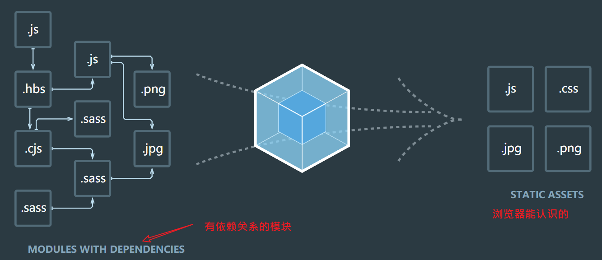

作为初学者：

- 理解 webpack 的作用
  - 改变前端开发的方式：传统=>工程化
  - 在前端脚手架工具（vue-cli）中已经集成了 webpack
  
- 掌握 webpack 的基本使用
  - webpack.config.js ：核心
    - mode
    - entry
    - output
    - devtool
    - module=>rules:[{loader配置}]
    - plugins
    - devServer
    - optimization(必须是生产模式 mode:'production')才生效
    
  - loader： 帮助 webpack 处理非 js 模块
    - 字体文件拷贝
    - 图片（自动转 base64）
    - js 降级
    - 编译.vue组件
    
  - plugin： 增强 webpack 的功能
    - 把 css 提取到一个文件，压缩
    - 用 HtmlWebpackPlugin 把指定模板.html 自动加载打包之后资源=》预览
    - webpack-dev-server 实时预览=》工程化=》开发调试
    - 清空上次打包文件
    
  - 优化webpack打包速度(build后的打的包)
  
    - 开启多进程打包.
  
      - #### thread-loader(webpack4官方推荐)
  
        ```js
        module.exports = {
          // ...
          module: {
            rules: [
              {
                test: /\.js$/,
                exclude: /node_modules/,
                // 创建一个 js worker 池
                use: [ 
                  'thread-loader',
                  'babel-loader'
                ] 
              },
              {
                test: /\.s?css$/,
                exclude: /node_modules/,
                // 创建一个 css worker 池
                use: [
                  'style-loader',
                  'thread-loader',
                  {
                    loader: 'css-loader',
                    options: {
                      modules: true,
                      localIdentName: '[name]__[local]--[hash:base64:5]',
                      importLoaders: 1
                    }
                  },
                  'postcss-loader'
                ]
              }
              // ...
            ]
            // ...
          }
          // ...
        }
        ```
  
        
  
      - 在webpack构建过程中，实际上耗费时间大多数用在 loader 解析转换以及代码的压缩中，HappyPack 可利用多进程对文件进行打包(默认cpu核数-1)，对多核cpu利用率更高。HappyPack 可以让 Webpack 同一时间处理多个任务，发挥多核 CPU 的能力，将任务分解给多个子进程去并发的执行，子进程处理完后，再把结果发送给主进程。
  
      - 合理利用缓存,使用`cache-loader`，`HardSourceWebpackPlugin` 或 `babel-loader` 的 `cacheDirectory` 标志
  
      - 优化压缩时间
  
 - 优化webapck启动项目时间
      - 如果使用 chrome 浏览器，那么在开发环境下，其实可以关闭 babel 的转义：includes: []。还有可以添加 babel 的缓存：loader: "babel-loader?cacheDirectory=true"
      - 配置exclude
        - exclude 是 loader 插件用来排除查找目录的，一般是 node_modules目录。exclude: /node_modules/

      - alias
        -alias 用来简化查找路径的，一般来说一些脚手架里面会默认配置 @代表 src目录，那么我们可以根据此分别配置不同的内容，来减少一级一级查找。
        
        
        
        
        
        
        
        
        
        
        
        
        
        


介阅:

https://juejin.cn/post/6844904071736852487


1. 项目背景

   (1). 我的项目是干什么的,

   2. 有什么优势,
   3. 带了什么好处
   4. 解决了什么问题

2. 项目难点

   1. 我遇到了什么问题
   2. 我怎么解决的
   3. 给我带了什么好处和优势 我学习到了什么
